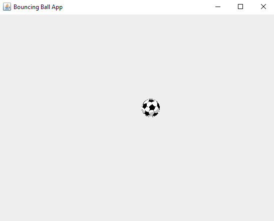
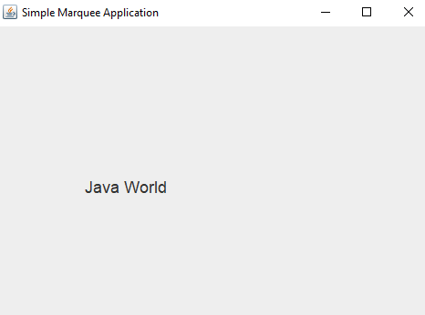

# Java Labs Repository

Welcome to the Java Labs repository! This repository contains a series of Java labs that cover various concepts and skills. Each lab is designed to help practice and enhance my Java programming abilities.

## Labs Overview

<!-- Lab1 -->
### Bouncing Ball Application

**Description:**
It's a GUI application that displays a ball which moves 
randomly on the application frame.

---

<!-- Lab2 -->
### Complex Numbers Calc Generic

**Description:**
A generic class that could be used to represent complex
numbers which contains some generic methods that represent basic arithmetic
operation on complex(addition, subtraction, etc…)

---

<!-- Lab3 -->
### Quadratic Equation Roots

**Description:**
Using the interfaces in java.util.function to build an application 
that defines the roots of an quadratic equation.

---

<!-- Lab4 -->
### Simple Marquee

**Description:**
A GUI application that displays marquee string on it.

---

<!-- Lab5 -->
### Simple Word Dictionary

**Description:**
A map that uses the alphabets as keys and a
collection as values (This collection should only contain
words starting with the corresponding key)

• The application stores words into that
collection.

• Provided methods to print all the letters and corresponding
words

• Provided method to print the words of a given letter

